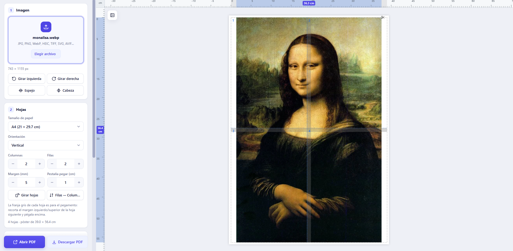

# Split — Imprimir una imagen en varias hojas

**Split** divide una imagen en varias hojas (A4, carta, oficio o un tamaño a medida) y genera un **PDF listo para imprimir**. Al pegar las hojas obtienes un póster grande. Cada hoja trae líneas de corte punteadas y una pestaña para el pegamento.

Todo ocurre en el navegador: **tus imágenes no se suben a ningún servidor**.

🌐 **Sitio:** [split.beyfast.com](https://split.beyfast.com)



---

## Índice

- [Funciones](#funciones)
- [Cómo se usa](#cómo-se-usa)
- [Cómo imprimir y armar el póster](#cómo-imprimir-y-armar-el-póster)
- [Formatos de imagen admitidos](#formatos-de-imagen-admitidos)
- [Estructura del proyecto](#estructura-del-proyecto)
- [Ejecutar en local](#ejecutar-en-local)
- [Publicar en GitHub Pages con split.beyfast.com](#publicar-en-github-pages-con-splitbeyfastcom)
- [SEO e indexación](#seo-e-indexación)
- [Actualizar las librerías](#actualizar-las-librerías)
- [Detalles técnicos](#detalles-técnicos)
- [Privacidad](#privacidad)

---

## Funciones

### Imagen
- Carga una imagen con clic o **arrastrándola** al recuadro o a la vista previa.
- **Girar** 90° a la izquierda o a la derecha.
- **Voltear** en espejo (horizontal) o de cabeza (vertical).

### Hojas
- **Tamaño de papel:** A4 (por defecto), Carta, Oficio, Legal, A3, Tabloide o **Personalizado**. Con Personalizado se abre un diálogo para escribir el ancho y el alto en cm.
- **Orientación** vertical u horizontal, y botones rápidos **Girar hojas** y **Filas ↔ Columnas**.
- **Columnas × filas**: de 1 a 20 en cada sentido.
- **Margen** en mm: la zona que la impresora no alcanza a imprimir.
- **Pestaña para pegar** en cm: una franja gris con la leyenda "PEGAR AQUÍ" en el borde derecho e inferior de cada hoja. La siguiente hoja se pega encima, así que la imagen queda continua.

### Ajuste de la imagen
| Modo | Qué hace |
|---|---|
| **Estirar** | Llena todas las hojas; puede deformar la imagen. |
| **Ajustar** | La hace lo más grande posible sin deformarla. |
| **Rellenar** | Cubre todas las hojas sin deformarla y recorta lo que sobra. |
| **Libre** | Mueves la imagen con el mouse o el dedo, cambias su tamaño desde las esquinas y haces zoom con la rueda. |

En el modo Libre puedes **mantener la proporción** y activar **"No salir de los bordes"**, para que la imagen choque con el borde del póster y no pueda crecer más allá.

### Vista previa y reglas
- **Reglas horizontal y vertical en centímetros.** Muestran en tiempo real cuánto medirá la imagen ya impresa y pegada.
- Indican los **dpi** efectivos y avisan si la imagen puede verse pixelada.
- El **panel de configuración se puede minimizar** para ver la vista previa más grande.

### Impresión y descarga
- **Líneas de corte punteadas** con una tijera ✂ dibujada en cada hoja.
- **Numeración** de cada hoja (fila y columna).
- Opción para **omitir hojas vacías**.
- **Calidad** de 150, 300 o 600 dpi. Nunca se escala por encima de la resolución original.
- **Abrir PDF** en otra pestaña para verlo, imprimirlo o descargarlo.
- **Descargar PDF** abre un diálogo con la **miniatura de cada hoja**:
  - Eliges qué hojas descargar (por defecto, todas).
  - Eliges el formato: **un solo PDF** con todas (por defecto) o **un PDF por hoja dentro de un `.zip`**.

### Otros
- Diseño **adaptado a celular**: la vista previa queda arriba y los controles debajo.
- **Aviso antes de recargar o cerrar** si tienes cambios sin descargar.
- Se puede **instalar como app** (PWA) desde el navegador.

---

## Cómo se usa

1. **Carga tu imagen** (sección 1).
2. **Elige el papel y cuántas hojas** quieres: columnas × filas (sección 2).
3. **Ajusta la imagen**: Ajustar, Estirar, Rellenar o Libre (sección 3). Mira en las reglas la medida final.
4. **Revisa las opciones de impresión**: líneas de corte, numeración y calidad (sección 4).
5. Pulsa **Descargar PDF**, elige las hojas y el formato, y descarga.

---

## Cómo imprimir y armar el póster

1. Imprime el PDF en **"Tamaño real" / escala 100 %**. **No** uses "Ajustar a la página", porque las hojas dejarían de coincidir.
2. Con tijera o cúter, **recorta cada hoja siguiendo la línea punteada**.
3. Pon **pegamento en la franja gris "PEGAR AQUÍ"** de una hoja.
4. **Coloca encima la hoja siguiente**, alineando su borde recortado con el inicio de la franja gris.
5. Arma primero cada fila de izquierda a derecha y luego pega las filas de arriba hacia abajo. Guíate por el número de cada hoja.

> 💡 Deja un margen de unos 5 mm: la mayoría de las impresoras no imprime hasta la orilla del papel.

---

## Formatos de imagen admitidos

| Formato | Cómo se abre |
|---|---|
| JPG, PNG, WebP, GIF, BMP, SVG, AVIF, ICO | Directamente en el navegador |
| **HEIC / HEIF** (fotos de iPhone) | Se convierte en el navegador con `heic2any` |
| **TIFF** | Se convierte en el navegador con `UTIF.js` + `pako` |

Las librerías de HEIC y TIFF **solo se cargan cuando subes uno de esos archivos**, así que no hacen más lenta la carga inicial de la página.

---

## Estructura del proyecto

```
.
├── index.html              # Página principal (HTML + metadatos SEO)
├── style.css               # Estilos y diseño adaptable a celular
├── app.js                  # Lógica: vista previa, reglas, generación de PDF/ZIP
├── ui.js                   # Controles propios: desplegables y botones −/+
├── vendor/                 # Librerías del navegador (no necesitan internet)
│   ├── jspdf.umd.min.js    #   Generación de PDF
│   ├── jszip.min.js        #   Generación de .zip
│   ├── heic2any.min.js     #   Conversión de HEIC
│   ├── UTIF.js             #   Conversión de TIFF
│   └── pako_inflate.min.js #   Descompresión para TIFF
├── img/
│   ├── og-image.png        # Imagen al compartir en redes (1200×630)
│   ├── icon-192.png        # Ícono de la app
│   ├── icon-512.png
│   └── icon-maskable-512.png
├── favicon.ico             # Ícono de la pestaña
├── apple-touch-icon.png    # Ícono para iPhone/iPad
├── manifest.webmanifest    # Configuración para instalar como app (PWA)
├── robots.txt              # Permisos para buscadores
├── sitemap.xml             # Mapa del sitio para Google
├── CNAME                   # Dominio propio para GitHub Pages
├── .nojekyll               # Indica a GitHub Pages que no procese con Jekyll
├── 404.html                # Página de error (redirige al inicio)
├── captura.png             # Captura usada en este README
├── scripts/copy-vendor.js  # Copia las librerías de node_modules a vendor/
└── package.json            # Solo para actualizar las librerías (opcional)
```

Es una **página 100 % estática**: no necesita Node, servidor ni base de datos para funcionar.

---

## Ejecutar en local

**Opción 1: doble clic.** Abre `index.html` directamente en Chrome, Edge o Firefox. Funciona todo.

**Opción 2: servidor local.** Es útil para probar el manifest o la instalación como app, que requieren `http://`:

```bash
# Con Node
npx serve .

# O con Python
python -m http.server 8652
```

Y abre `http://localhost:8652` (o el puerto que indique `serve`).

---

## Publicar en GitHub Pages con `split.beyfast.com`

### 1. Subir el proyecto a GitHub
```bash
git init
git add .
git commit -m "Split: página estática"
git branch -M main
git remote add origin https://github.com/<tu-usuario>/<tu-repo>.git
git push -u origin main
```

> No subas `node_modules/`. Si llegara a existir, agrégala a un `.gitignore`.

### 2. Activar GitHub Pages
1. En el repositorio, entra a **Settings → Pages**.
2. En **Source** elige **Deploy from a branch**.
3. Selecciona la rama **`main`** y la carpeta **`/ (root)`**, y guarda.

### 3. Dominio propio
El archivo `CNAME` ya contiene `split.beyfast.com`, así que GitHub lo detecta solo.

En el proveedor DNS de **beyfast.com**, crea este registro:

| Tipo | Nombre / Host | Valor / Destino |
|---|---|---|
| `CNAME` | `split` | `<tu-usuario>.github.io` |

Después, en **Settings → Pages**:
- Espera a que el dominio aparezca como verificado. La propagación DNS puede tardar desde minutos hasta 24 h.
- Activa **Enforce HTTPS**.

> Recomendado: en **Settings (de tu cuenta) → Pages → Verified domains**, verifica `beyfast.com`, para que nadie más pueda usar tus subdominios en GitHub Pages.

---

## SEO e indexación

La página incluye todo lo necesario para aparecer en Google y verse bien al compartirla:

| Elemento | Dónde | Para qué |
|---|---|---|
| `<title>` y `<meta name="description">` | `index.html` | Título y resumen en los resultados de Google |
| `<meta name="keywords">` | `index.html` | Palabras clave (Google casi no las usa; otros buscadores sí) |
| `<meta name="robots">` | `index.html` | Permite indexar y mostrar la imagen de vista previa en grande |
| `<link rel="canonical">` | `index.html` | URL oficial: `https://split.beyfast.com/` |
| `hreflang` | `index.html` | Indica que el sitio está en español |
| **Open Graph** (`og:*`) | `index.html` | Tarjeta al compartir en WhatsApp, Facebook, LinkedIn y Telegram |
| **Twitter Card** | `index.html` | Tarjeta grande al compartir en X/Twitter |
| **JSON-LD** (`WebApplication`, `Organization`, `WebSite`) | `index.html` | Datos estructurados para resultados enriquecidos |
| `<h1>` accesible y `<noscript>` | `index.html` | Texto que Google y los lectores de pantalla pueden leer |
| `robots.txt` | raíz | Permite rastrear el sitio e indica dónde está el sitemap |
| `sitemap.xml` | raíz | Lista la URL y sus imágenes para Google |
| `manifest.webmanifest` + íconos | raíz, `img/` | App instalable, e ícono en Android e iOS |

### Después de publicar
1. Entra a [Google Search Console](https://search.google.com/search-console) y agrega la propiedad `https://split.beyfast.com/`. También puedes agregar el dominio completo `beyfast.com` si verificas por DNS.
2. En **Sitemaps**, envía `https://split.beyfast.com/sitemap.xml`.
3. En **Inspección de URLs**, pide indexar `https://split.beyfast.com/`.
4. Revisa los datos estructurados con la [Prueba de resultados enriquecidos](https://search.google.com/test/rich-results).
5. Revisa la tarjeta al compartir con el [depurador de Facebook](https://developers.facebook.com/tools/debug/) o pegando el enlace en WhatsApp.

> Cuando hagas cambios importantes, actualiza la fecha `<lastmod>` en `sitemap.xml`.

---

## Actualizar las librerías

Las librerías ya están copiadas en `vendor/`, así que **no necesitas Node para usar ni publicar la página**. Solo para actualizarlas a una versión nueva:

```bash
npm install        # descarga las librerías y las copia solas a vendor/
npm run vendor     # (opcional) vuelve a copiarlas manualmente
```

Después puedes borrar `node_modules/`.

| Librería | Uso | Licencia |
|---|---|---|
| [jsPDF](https://github.com/parallax/jsPDF) | Generar los PDF | MIT |
| [JSZip](https://github.com/Stuk/jszip) | Empaquetar un PDF por hoja en `.zip` | MIT / GPLv3 |
| [heic2any](https://github.com/alexcorvi/heic2any) | Convertir fotos HEIC/HEIF | MIT |
| [UTIF.js](https://github.com/photopea/UTIF.js) | Leer imágenes TIFF | MIT |
| [pako](https://github.com/nodeca/pako) | Descomprimir TIFF con compresión deflate | MIT / Zlib |

---

## Detalles técnicos

- **Unidades:** todo se calcula en milímetros. El tamaño final del póster es `columnas × (ancho imprimible) − (columnas − 1) × pestaña`, y lo mismo para el alto.
- **Calidad del PDF:** cada hoja recorta **solo su parte de la imagen original**, a la resolución original o al dpi elegido (lo que sea menor), y la inserta como JPEG. Así se mantiene la nitidez sin inflar el archivo.
- **Pestañas:** la franja de pegado de una hoja queda debajo de la hoja siguiente, así que en esa zona no se imprime imagen. Por eso no hay partes repetidas ni cortes en el póster armado.
- **Rendimiento:** las hojas se generan una por una, cediendo el control al navegador entre cada una, para no congelar la página.
- **Compatibilidad:** Chrome, Edge, Firefox y Safari recientes, en computadora y celular.

---

## Privacidad

Split no tiene servidor: **las imágenes nunca salen de tu dispositivo**. La carga, la conversión y la generación del PDF se hacen en tu navegador. La página solo guarda en tu navegador (`localStorage`) si dejaste minimizado el panel de configuración.

---

Hecho por **[BeyFast](https://beyfast.com)**.
